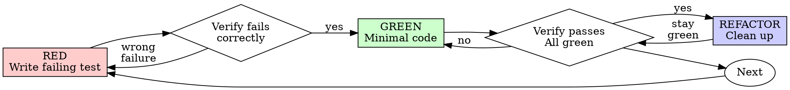

## 验证清单

### 完整开发任务流程

#### 准备阶段

- [ ] 识别任务类型（开发/调试/设计）
- [ ] 调用相关 SKILL（遵循 1% 规则）
- [ ] 读取并理解 SKILL 要求
- [ ] 检查现有 worktree 目录
- [ ] 验证 .gitignore 配置
- [ ] 创建 worktree
- [ ] 验证基线测试通过

#### 开发任务（每个功能）

- [ ] 检查并调用相关 SKILL
- [ ] 创建隔离的 worktree
- [ ] 验证 worktree 目录已忽略
- [ ] 验证基线测试通过
- [ ] 使用 TDD：先写失败的测试
- [ ] 验证测试因功能缺失而失败
- [ ] 实现最小化代码
- [ ] 验证测试通过
- [ ] 请求代码审查
- [ ] 修复审查中的 Critical/Important 问题
- [ ] 完成后验证所有测试通过


---

## 工作隔离（Git Worktrees）

### 目录选择优先级

1. 检查现有目录：`.worktrees/` 或 `worktrees/`
2. 检查 CLAUDE.md 配置
3. 询问用户

### 安全验证

- [ ] **项目本地 worktree**：必须验证 `.gitignore` 包含目录
- [ ] **如果未忽略**：添加到 `.gitignore` → 提交 → 继续
- [ ] **全局目录**：无需验证（在项目外部）

### 创建步骤

- [ ] 检测项目名称
- [ ] 创建 worktree：`git worktree add <path> -b <branch>`
- [ ] 自动检测并安装依赖（package.json/Cargo.toml 等）
- [ ] 验证基线测试通过
- [ ] 报告位置和状态


---

## 测试驱动开发（TDD）

### 铁律

```
NO PRODUCTION CODE WITHOUT A FAILING TEST FIRST
```

### TDD 循环



### TDD 步骤

- [ ] **RED**: 先写失败的测试
- [ ] **验证 RED**: 目睹测试失败（因功能缺失，非错误）
- [ ] **GREEN**: 最小化实现代码
- [ ] **验证 GREEN**: 目睹测试通过
- [ ] **REFACTOR**: 在绿色状态下清理代码

### TDD 例外（需用户明确许可）

- 丢弃型原型
- 生成的代码
- 配置文件

---

## 系统化调试

### 铁律

```
NO FIXES WITHOUT ROOT CAUSE INVESTIGATION FIRST
```

### 四个阶段

- [ ] **Phase 1: 根因调查**
  - 仔细阅读错误消息
  - 一致地重现问题
  - 检查最近的更改
  - 多组件系统：在每个边界添加诊断日志
  - 追踪数据流至源头

- [ ] **Phase 2: 模式分析**
  - 找到工作参考示例
  - 与参考对比
  - 识别差异

- [ ] **Phase 3: 假设测试**
  - 形成单一假设
  - 最小化测试
  - 验证假设

- [ ] **Phase 4: 实现**
  - 创建失败测试用例
  - 实现单一修复
  - 验证修复
  - **3 次失败后质疑架构**

### 调试红旗

**当你出现以下想法时，立即返回 Phase 1：**

- "快速修复以后调查"
- "就试一下这个修改"
- "多个修改一起试，看哪个有效"
- "3次失败了，再试一次"
