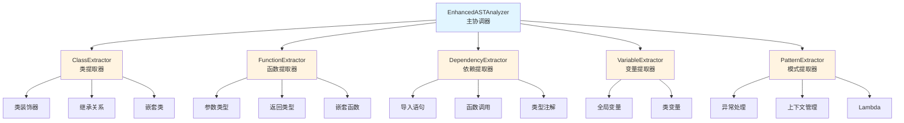

# Architecture Generator

自动生成项目架构文档，帮助 Claude 和开发者快速理解代码库结构。

## 核心功能

1. **文件结构扫描** - 生成项目文件树（遵循 .gitignore）
2. **分层依赖分析** - 自动按节点阈值拆分，生成多层 Mermaid 依赖关系图
3. **增强符号索引** - 构建可查询的符号数据库，支持高级 Python 特性
4. **增量扫描** - 只处理修改过的文件，大幅提升性能（80-90%）
5. **多语言支持** - Python、JavaScript、TypeScript、Go、Rust、Java、Ruby、C/C++、C#、PHP

## 增强的 Python AST 提取

本技能包含增强的 Python AST（抽象语法树）提取器，提供比基础实现更详细的代码分析。

### 支持的高级特性

#### 类提取
- ✅ 完整类信息：装饰器、基类、方法、类变量、嵌套类
- ✅ 特殊类类型检测：
  - 抽象基类（ABC）
  - 数据类（@dataclass）
  - 异常类（Exception）
- ✅ 嵌套类提取
- ✅ 类变量和类型注解

#### 函数提取
- ✅ 完整参数信息：
  - 位置-only 参数（/ 分隔符）
  - 常规参数
  - *args
  - 关键字-only 参数（* 分隔符）
  - **kwargs
- ✅ 类型注解和默认值
- ✅ 返回类型
- ✅ 特殊函数类型：
  - 异步函数（async def）
  - 生成器（yield）
  - 异步生成器（async yield）
  - 方法装饰器（@property, @staticmethod, @classmethod）
- ✅ 嵌套函数提取
- ✅ await 表达式计数

#### 依赖提取
- ✅ 导入语句分析
- ✅ 函数调用依赖
- ✅ 类实例化依赖
- ✅ 类型注解依赖
- ✅ 内部 vs 外部依赖区分

#### 高级模式提取
- ✅ 异常处理器（try-except 块）
- ✅ 上下文管理器（with 语句）
- ✅ Lambda 函数
- ✅ 全局变量和类变量

### 提取器架构



### 使用示例

#### Python API

```python
from pathlib import Path
from enhanced_ast_analyzer import EnhancedASTAnalyzer

# 初始化分析器
analyzer = EnhancedASTAnalyzer(project_path=Path("/path/to/project"))

# 分析文件
result = analyzer.analyze_file(Path("src/main.py"))

# 访问类信息
for cls in result['classes']:
    print(f"类: {cls['name']}")
    print(f"  装饰器: {cls['decorators']}")
    print(f"  基类: {cls['bases']}")
    print(f"  方法: {[m['name'] for m in cls['methods']]}")
    print(f"  类型: 抽象={cls['is_abstract']}, 数据类={cls['is_dataclass']}")

# 访问函数信息
for func in result['functions']:
    print(f"函数: {func['name']}")
    params = [p['name'] for p in func['parameters']]
    print(f"  参数: {', '.join(params)}")
    print(f"  返回类型: {func['return_type']}")
    print(f"  类型: async={func['is_async']}, 生成器={func['is_generator']}")
```

#### 命令行

```bash
# 分析单个文件
python enhanced_ast_analyzer.py /path/to/file.py

# 构建符号索引（使用增强提取器）
python build_symbol_index.py /path/to/project

# 分析依赖关系（使用增强提取器）
python analyze_dependencies.py /path/to/project
```

### 提取结果示例

#### 类信息

```json
{
  "name": "Rectangle",
  "file_path": "example.py",
  "line_number": 42,
  "end_line_number": 66,
  "decorators": [],
  "bases": [],
  "methods": [
    {
      "name": "__init__",
      "parameters": [
        {"name": "self", "type_annotation": null},
        {"name": "width", "type_annotation": "float"},
        {"name": "height", "type_annotation": "float"}
      ],
      "return_type": null,
      "is_method": true
    },
    {
      "name": "area",
      "parameters": [{"name": "self"}],
      "return_type": "float",
      "is_method": true
    },
    {
      "name": "size",
      "parameters": [{"name": "self"}],
      "return_type": "float",
      "is_property": true
    }
  ],
  "is_abstract": false,
  "is_dataclass": false,
  "is_exception": false
}
```

#### 函数信息

```json
{
  "name": "fetch_data",
  "file_path": "example.py",
  "line_number": 101,
  "decorators": [],
  "parameters": [
    {
      "name": "url",
      "type_annotation": "str",
      "default_value": null
    }
  ],
  "return_type": "Dict",
  "docstring": "获取数据",
  "is_async": true,
  "is_method": false,
  "is_generator": false,
  "is_async_generator": false,
  "await_count": 1
}
```

### 集成和回退机制

增强的 AST 提取器已集成到现有代码中：

1. **build_symbol_index.py** - 使用增强提取器收集符号信息
2. **analyze_dependencies.py** - 使用增强提取器分析依赖关系

**自动回退机制**：
- 如果增强提取器失败，系统自动回退到基础实现
- 确保向后兼容性和稳定性

## 快速开始

### 基本用法

```bash
cd /path/to/project
python .claude/skills/architecture-generator/scripts/generate.py .
```

输出到 `docs/static/architecture/` 目录，包含：
- `README.md` - 主入口（目录和概览）
- `file-structure.md` - 文件结构树
- `dependencies/` - 分层依赖关系图（Mermaid）
- `symbols-index.md` - 符号索引说明

### 高级选项

```bash
# 指定输出目录
python scripts/generate.py . --output ./docs/arch

# 限制扫描深度
python scripts/generate.py . --max-depth 3

# 设置依赖图节点阈值（自动分层）
python scripts/generate.py . --threshold 30

# 强制全量扫描
python scripts/generate.py . --full-scan

# 禁用增量扫描
python scripts/generate.py . --no-incremental
```

### 配置文件

创建 `.architecture-generator.yaml`：

```yaml
# 依赖图节点数阈值（自动分层）
node_threshold: 25

# 最大扫描深度
max_depth: null

# 是否启用增量扫描
incremental: true

# 额外的排除模式
exclude:
  - node_modules/
  - __pycache__/

# 输出目录
output_dir: docs/static/architecture
```

## 工作流程

### 1. 生成文档

```bash
python scripts/generate.py .
```

### 2. 查看文档

从 [docs/static/architecture/README.md](docs/static/architecture/README.md) 开始浏览。

### 3. 查询符号

```bash
# 查找特定符号
python scripts/query_index.py . find User

# 搜索符号
python scripts/query_index.py . search parse

# 查看文件中的符号
python scripts/query_index.py . file src/main.py

# 查看统计信息
python scripts/query_index.py . stats
```

## 典型使用场景

### 场景 1: 理解新项目

**用户**: "帮我理解这个项目的架构"

**Claude 执行流程**:
1. 读取 `docs/static/architecture/README.md` 获取项目概览
2. 查看 `file-structure.md` 了解文件组织
3. 分析 `dependencies/level-0.md` 理解模块依赖
4. 使用增强的符号索引查询关键类和函数

### 场景 2: 代码导航

**用户**: "找到所有调用 `processData` 函数的地方"

**Claude**:
```bash
python scripts/query_index.py . find processData
```

### 场景 3: 重构支持

**用户**: "重构 `User` 类，需要了解它的所有依赖"

**Claude**:
1. 查看 `User` 类的定义（增强符号索引包含完整类信息）
2. 分析继承关系和基类
3. 查看所有方法及其参数
4. 找出所有引用 `User` 类的文件

### 场景 4: Python 深度分析

**用户**: "分析这个 Python 项目的高级特性使用情况"

**Claude**:
1. 查找所有异步函数
2. 识别所有生成器
3. 找出所有抽象基类和数据类
4. 分析异常处理模式
5. 检查上下文管理器使用

## 性能优化

### 增量扫描

- 首次运行：全量扫描
- 后续运行：仅扫描修改文件，节省 **80-90%** 时间
- 自动判断：变更比例超过 50% 时自动全量扫描

### 分层依赖图

- 默认节点阈值：25
- 自动按文件夹拆分大型项目的依赖图
- 最多支持 3 层嵌套（level-0, level-1, level-2）

### 性能基准

| 项目规模 | 首次运行 | 增量运行 | 提升 |
|---------|---------|---------|------|
| 小型（<100 文件） | ~2s | ~1s | 50% |
| 中型（100-1000 文件） | ~10s | ~2s | 80% |
| 大型（>1000 文件） | ~60s | ~6s | 90% |

## 资源文件说明

### scripts/

核心脚本：
- `utils.py` - 工具函数（.gitignore 解析、文件类型检测）
- `scan_file_structure.py` - 文件结构扫描
- `analyze_dependencies.py` - 依赖关系分析（使用增强提取器）
- `build_symbol_index.py` - 符号索引构建（使用增强提取器）
- `query_index.py` - 索引查询接口
- `generate.py` - 主脚本（协调整个流程）
- `incremental_scanner.py` - 增量扫描支持
- `config_manager.py` - 配置文件管理

增强 AST 提取器：
- `enhanced_ast_analyzer.py` - 主分析器（协调器）
- `ast_extractors/__init__.py` - 包初始化
- `ast_extractors/base_extractor.py` - 基础提取器类
- `ast_extractors/class_extractor.py` - 类提取器
- `ast_extractors/function_extractor.py` - 函数提取器
- `ast_extractors/dependency_extractor.py` - 依赖提取器
- `ast_extractors/variable_extractor.py` - 变量提取器
- `ast_extractors/pattern_extractor.py` - 模式提取器
- `ast_extractors/call_graph_builder.py` - 调用图构建器

文档和示例：
- `README_ENHANCED_AST.md` - 增强提取器功能文档
- `example_sample.py` - 示例文件（展示各种 Python 特性）

### assets/templates/

- `README.md.j2` - 主文档模板
- `file-structure.md.j2` - 文件结构模板
- `dependency-graph.md.j2` - 依赖图模板
- `symbols-index.md.j2` - 符号索引说明模板

### references/

- [usage-guide.md](references/usage-guide.md) - 完整使用指南
- [README_ENHANCED_AST.md](scripts/README_ENHANCED_AST.md) - 增强提取器详细文档

## 故障排除

### 问题: 增强提取器导入失败

**症状**: 看到警告 "Enhanced AST extraction not available"

**说明**:
- 增强提取器需要 Python 3.8+
- 如果导入失败，系统自动回退到基础实现
- 不影响基本功能的使用

**解决方法**:
```bash
# 检查 Python 版本
python --version  # 需要 >= 3.8

# 检查必需的模块
python -c "import ast; print(ast.__version__)"
```

### 问题: 符号数据库找不到

```bash
# 确认数据库路径
ls docs/static/architecture/.cache/symbols.db

# 重新生成索引
python scripts/build_symbol_index.py . --output docs/static/architecture/.cache/symbols.db
```

### 问题: 依赖图为空

可能原因：
1. 项目中没有支持的源代码文件
2. 所有文件都被 .gitignore 排除
3. 依赖检测失败（语法错误）

解决方法：
```bash
# 检查扫描的文件
python scripts/scan_file_structure.py .

# 手动测试依赖分析
python scripts/analyze_dependencies.py . 2>&1 | head -50
```

## 技术细节

### 模块化设计

每个提取器都是独立的，可以单独使用或组合使用：

```python
from ast_extractors import ClassExtractor, FunctionExtractor
from pathlib import Path

# 只提取类
class_extractor = ClassExtractor(file_path, root_path)
classes = class_extractor.extract()

# 只提取函数
func_extractor = FunctionExtractor(file_path, root_path)
functions = func_extractor.extract()
```

### 健壮性设计

- 自动回退到基础实现
- 优雅的错误处理
- 兼容现有代码
- AST 树缓存优化

### 可扩展性

易于添加新的提取器：

1. 继承 `BaseExtractor`
2. 实现 `extract()` 方法
3. 在 `EnhancedASTAnalyzer` 中注册

## 参考资源

- [完整使用指南](references/usage-guide.md) - 详细的使用说明和示例
- [增强提取器文档](scripts/README_ENHANCED_AST.md) - 增强提取器完整功能说明
- [Mermaid 图语法](https://mermaid.js.org/syntax/flowchart.html)
- [Python AST 模块](https://docs.python.org/3/library/ast.html)
- [Green Tree Snakes AST 指南](https://greentreesnakes.readthedocs.io/)

## 更新日志

### v1.1.0 (2026-02-05)
- ✅ 新增增强 Python AST 提取器
- ✅ 支持类装饰器、方法类型检测
- ✅ 支持异步函数、生成器检测
- ✅ 支持嵌套类和嵌套函数
- ✅ 支持异常处理、上下文管理器、Lambda 提取
- ✅ 自动回退机制确保向后兼容
- ✅ 完整的测试覆盖和文档

### v1.0.0
- 初始版本
- 基础文件结构扫描
- 依赖关系分析
- 符号索引构建
- 增量扫描支持
